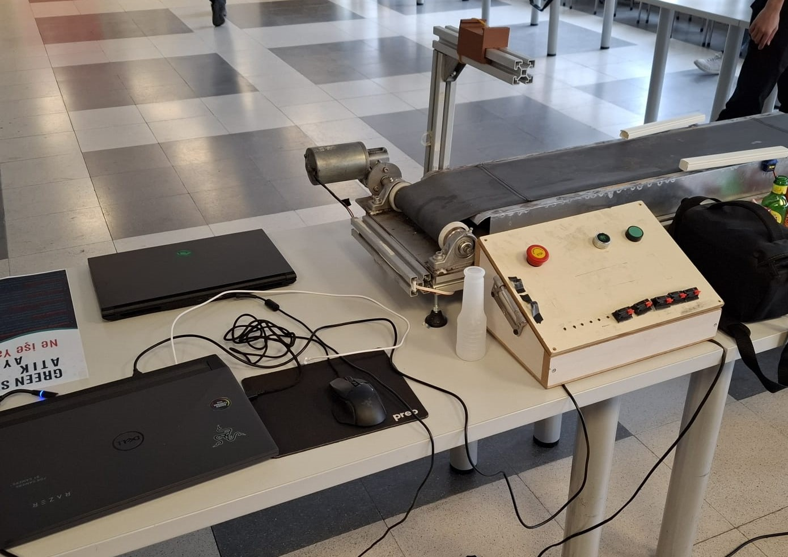

# GreenSort
GreenSort cihazı atık ayırma projesidir.
Projenin temel amacı, geri dönüştürülebilir atıkların ayrımının yapılabilmesidir. Geri dönüştürülebilir ise atıkların ana maddesine göre bölgelere ayrılıyor.

Projede yapay zeka uygulamaları için YOLOv8 kütüphanesi kullanılmıştır. Yapay zeka modeli, Google Colab altyapısı üzerinde, Roboflow platformundaki hazır görüntüler ve kendi derlenen veri setimiz kullanılarak eğitilmiştir.

