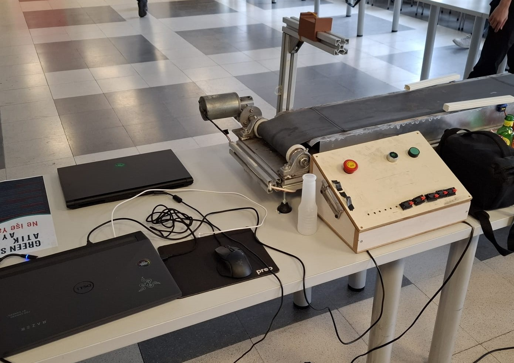
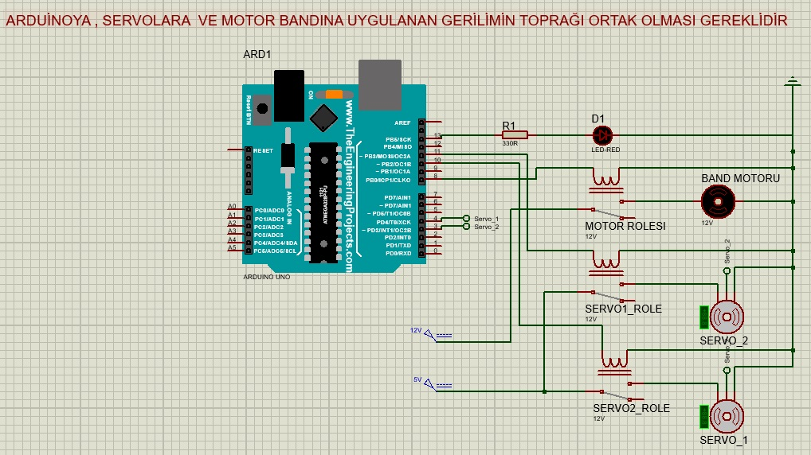
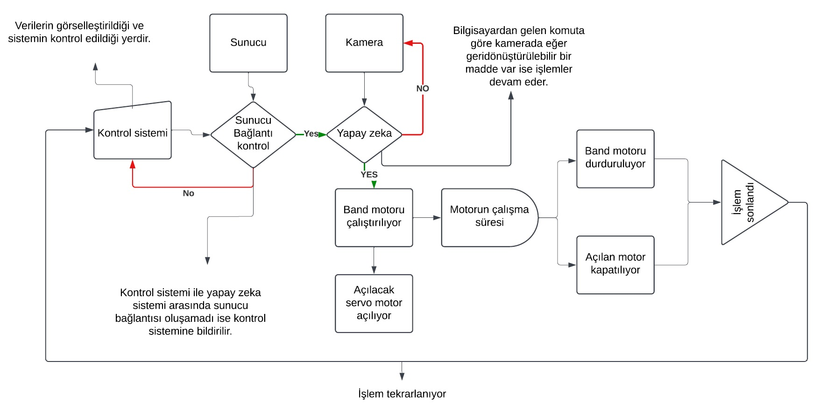

# GreenSort

GreenSort cihazı atık ayırma projesidir.Projenin temel amacı, geri dönüştürülebilir atıkların ayrımının yapılabilmesidir. Geri dönüştürülebilir ise atıkların ana maddesine göre bölgelere ayrılıyor.

NOT : Proje kapsamında, başlangıçta Arduino kullanılarak geliştirilen sistem daha profesyonel bir yapıya kavuşturulmak amacıyla PLC tabanlı olarak yeniden tasarlanmıştır. PLC’nin Arduino’ya kıyasla daha uzun süreli, kararlı ve verimli çalışabilmesi nedeniyle bu değişiklik uygulanmış; sistem uyumluluğu sağlanarak gerekli güncellemeler yapılmıştır. Yapılan geliştirmeler sonucunda sistemin daha verimli çalıştığı gözlemlenmiştir.PLC'nin lad ve scl kodlarını githup desteklemediginden resim olarak eklenmiştir. 

Projede yapay zeka uygulamaları için YOLOv8 kütüphanesi kullanılmıştır. Yapay zeka modeli, Google Colab altyapısı üzerinde, Roboflow platformundaki hazır görüntüler ve kendimizin çektiği fotoğraflar ile eğitilmiştir.

 

 - Telefonun kamera görüntüsü CAMO uygulaması kullanılarak aktarılıyor.

- Projenin yazılım kısmında python ve C/C++ programlama dilleri kullanılmıştır.
- python programla dili Görüntü işleme ,yapay zeka ,Socketler arası iletişim ve menü oluşturmada kullanılmıştır.
- C/C++ programlama dili ise mikrodenetleyicinin servo , motor ve motorların çalışma süresi gibi işlemleri yapmak için kullanılmıştır.

# Arduino bağlantı şeması :

Ana bilgisayar ile mikrodenetleyici arasındaki iletişim seri port üzerinden sağlanmaktadır. Arduino, gerilimini USB portundan alırken, servo ve motorlar için ayrı güç kaynakları kullanılmaktadır. Motorlar için 12V sabit gerilim, servolar için ise 5V sabit gerilim sağlanmış olup, tüm güç kaynaklarının ve arduinon toprak hatları (GND) birleştirilmiştir.

# Çalışma diyagramı :  

  - Kontrol sistemi ile yapay zeka arasındaki soket bağlantısı üzerinden komutlar iletilmektedir. Kontrol sistemi bir komut gönderdiğinde, yapay zeka aldığı görüntüde geri dönüştürülebilir bir atık tespit ederse, atığın türüne uygun kutunun servo motorları açılır. Geri dönüşüm atığı, servo motor yardımıyla ilgili kutuya yönlendirilirken bu süreç boyunca motorlar çalışır. İşlem tamamlandığında motorlar durur, servo kapanır ve geri dönüşüm atığı kutuya bırakılır. Bir sonraki işlem, kontrol sisteminden yeni bir komut alınıncaya kadar başlatılmaz.

# Ana gerekli magzemeler  : 

    - Ana bilgisayar(Kişisel bilgisayarım) veya raspberry gibi mini bilgisayarlarda kullanılabilir.

    - 2 tane servo 

    - 12v motor 

    - Bant 

    - kamera(kişisel telefonumu kullandım) 

    - AC-DC Dönüştürücü 220v-12v

    - Röle 

    - Stop butonu
   
  # PLC - PYTHON :

       - PLC(SIEMENS - s7-S1511) : Sanal ortamdada çalıştırılıbilir.
  
  # ARDUİNO - PYTHON : 
    
       - Arduino

