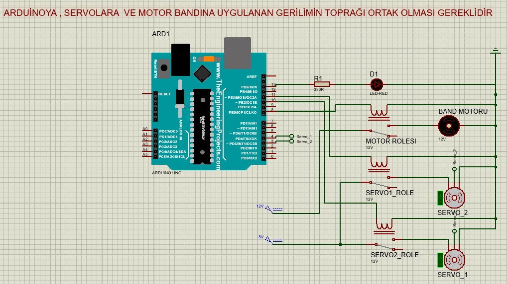

# GreenSort

NOT : GreenSort projesi geliştirme aşamasında olması sebebiyle bazı fonksiyonlar çalışmıyor durumdadır ama temel yapması gereken işlemleri yapıyor.

GreenSort cihazı atık ayırma projesidir.Projenin temel amacı, geri dönüştürülebilir atıkların ayrımının yapılabilmesidir. Geri dönüştürülebilir ise atıkların ana maddesine göre bölgelere ayrılıyor.

Projede yapay zeka uygulamaları için YOLOv8 kütüphanesi kullanılmıştır. Yapay zeka modeli, Google Colab altyapısı üzerinde, Roboflow platformundaki hazır görüntüler ve kendimizin çektiği fotoğraflar ile eğitilmiştir.

 

 - Telefonun kamera görüntüsü CAMO uygulaması kullanılarak aktarılıyor.

- Projenin yazılım kısmında python ve C/C++ programlama dilleri kullanılmıştır.
- python programla dili Görüntü işleme ,yapay zeka ,Socketler arası iletişim ve menü oluşturmada kullanılmıştır.
- C/C++ programlama dili ise mikrodenetleyicinin servo , motor ve motorların çalışma süresi gibi işlemleri yapmak için kullanılmıştır.

# Arduino bağlantı şeması :

Ana bilgisayar ile mikrodenetleyici arasındaki iletişim seri port üzerinden sağlanmaktadır. Arduino, gerilimini USB portundan alırken, servo ve motorlar için ayrı güç kaynakları kullanılmaktadır. Motorlar için 12V sabit gerilim, servolar için ise 5V sabit gerilim sağlanmış olup, tüm güç kaynaklarının ve arduinon toprak hatları (GND) birleştirilmiştir.

# Çalışma diyagramı :  

  - Kontrol sistemi ile yapay zeka arasındaki soket bağlantısı üzerinden komutlar iletilmektedir. Kontrol sistemi bir komut gönderdiğinde, yapay zeka aldığı görüntüde geri dönüştürülebilir bir atık tespit ederse, atığın türüne uygun kutunun servo motorları açılır. Geri dönüşüm atığı, servo motor yardımıyla ilgili kutuya yönlendirilirken bu süreç boyunca motorlar çalışır. İşlem tamamlandığında motorlar durur, servo kapanır ve geri dönüşüm atığı kutuya bırakılır. Bir sonraki işlem, kontrol sisteminden yeni bir komut alınıncaya kadar başlatılmaz.

# Kullanılan malzemeler  : 
    
    1-) Arduino 
    
    2-) Ana bilgisayar(Kişisel bilgisayarım) veya raspberry gibi mini bilgisayarlarda kullanılabilir.
    
    3-) 2 tane servo 
    
    4-) 12v motor 
    
    5-) Bant 
    
    6-) kamera(kişisel telefonumu kullandım) 

    7-) AC-DC Dönüştürücü 220v-12v

    8-) Röle 

    9-) Stop butonu

